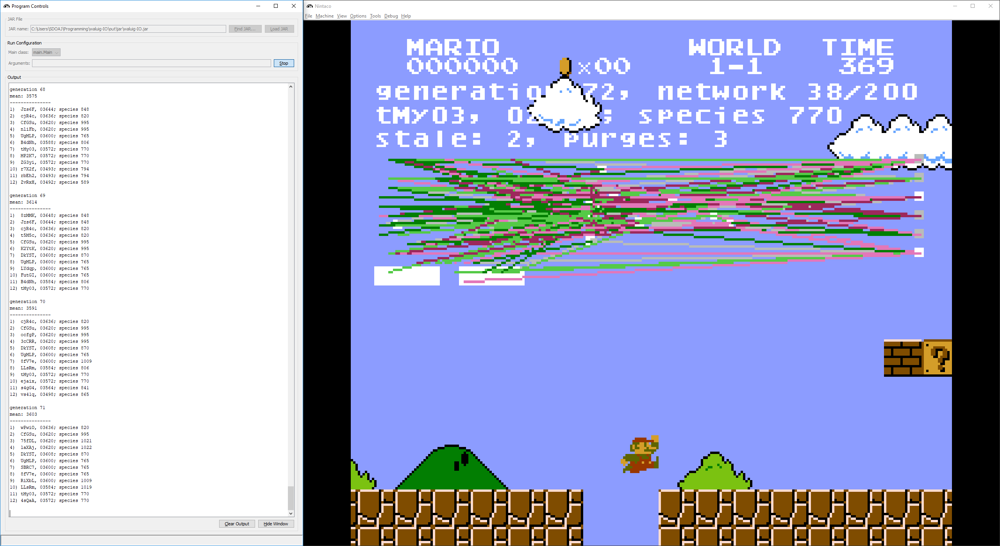

# WaluigI/O

A Super Mario Bros genetic algorithm inspired by SethBling's MarI/O

## Installation Instructions

1. Download Nintaco [here](https://nintaco.com/) and extract it
2. Download the Super Mario Bros ROM and save state [here](https://drive.google.com/open?id=15D7wKkMGNVhJRLTP0S6Q6Oax8jYZkCnH)
3. Extract the downloaded waluig-IO folder and move the two folders inside to the extracted Nintaco folder from step 1
4. Download the latest version of `waluig-IO.jar` [here](https://github.com/AdityaGupta1/waluig-IO/releases)
5. Run `Nintaco.jar` from your Nintaco folder
6. Select "File > Open..." and select your Super Mario Bros ROM file from steps 2 and 3 (which should be located at `games/Super Mario Bros.nes`)
7. Select "Tools > Run Program..." and a window titled "Run Program" will pop up
8. Click "Find JAR..." and select your downloaded `waluig-IO.jar` file from step 4
9. Click "Load JAR", then click "Run"
10. The program should start running and you should see some generation and species info show in the game

## WalugI/O in action

The main window (on the right) is the actual game being played by the program. At the top, there is information on the current network and generation, as well as how many purges there have been. Purges happen after the mean does not improve for a set number of generations; they allow only the top two species to reproduce and often result in a major breakthrough.

The boxes and lines in the main window represent nodes and connections. The boxes on the left are the blocks and enemies in the game, the boxes on the right are the buttons being pressed, and the boxes in the middle are hidden nodes. Lines are colored based on their weight - darker is larger absolute value and green and red represent positive and negative, respectively. Light gray lines are disabled connections.

Nodes work by summing up the values of nodes and connections coming into them, performing a function, then sending that value on to the next nodes. A node takes the product of each input node and its connection, adds those products up, then performs its function on them. Input nodes simply provide values - 10 for a block, -10 for an enemy, and 0 for neither. Hidden and output nodes perform a modified sigmoid function on the value they receive. Output nodes press their corresponding button if their value (after the function) is greater than 0.

The output window (on the left) shows the top 12 (number configurable) of each generation, as well as their mean. It also shows when purges happen and which species were allowed to create offspring after each purge.

See [this paper](http://nn.cs.utexas.edu/downloads/papers/stanley.ec02.pdf) for more details.